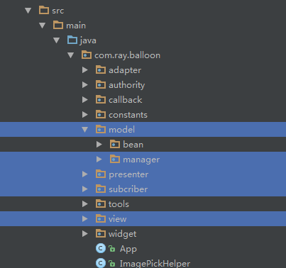
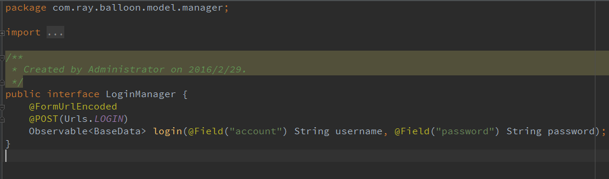
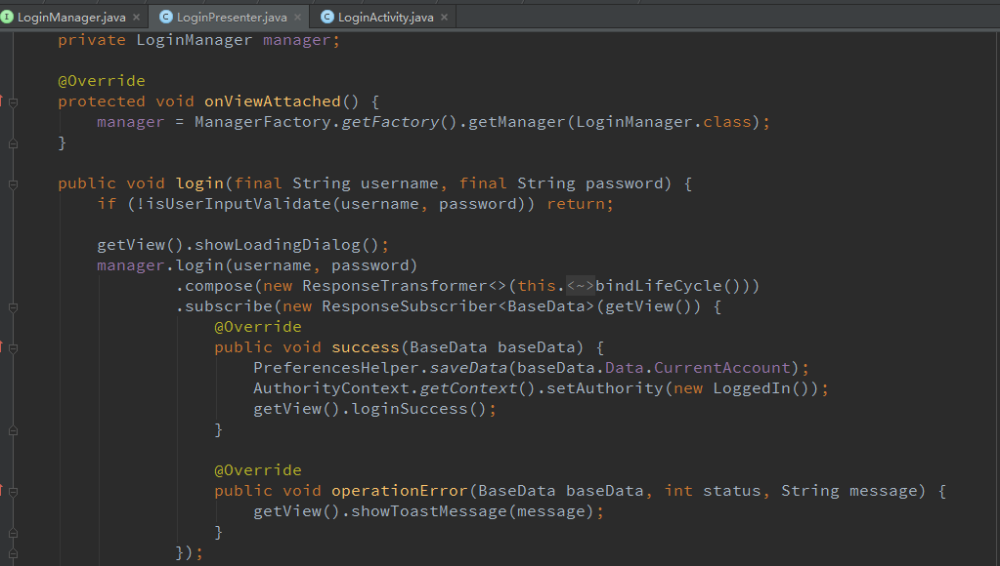
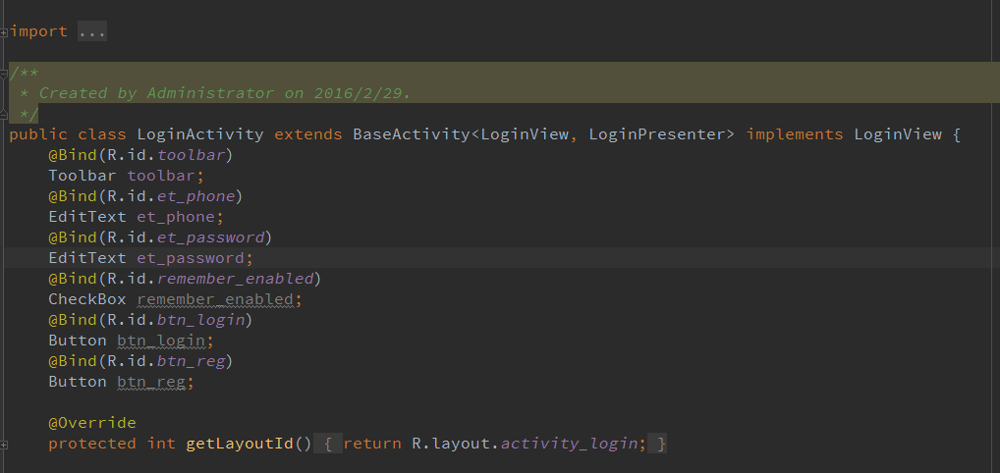

# 最新改版
> 由于长时间未进行android开发，所以此项目未更新，近期由于项目原因，需要搭建一个简易脚手架，借鉴此项目并且优化相关内容。

## 优化
- 添加了热更新操作（tinker）
- 添加了快速多渠道打包（walle）
- 添加自动化处理脚本，配合jenkins自动化操作
- 优化网络请求
- 添加hybird基础类

飞机票[android脚手架](https://github.com/xmtj/androidBase)

# ShareFramework
> 分享我认为是android最好也是最敏捷的开发框架（不能叫框架，一种开发模式），里面包含RxJava，RxAndroid，Mvp架构,Retrofit，Gson，Picasso（当然以后我会把图片加载框架换成Fresco，我认为最牛的图片加载框架）。

- 先看下效果：
> 

- 再看下项目目录结构：

> 
> 
> 
> 

> [类图请查看](https://github.com/ray0807/ShareFramework/tree/master/%E7%B1%BB%E5%9B%BE)

